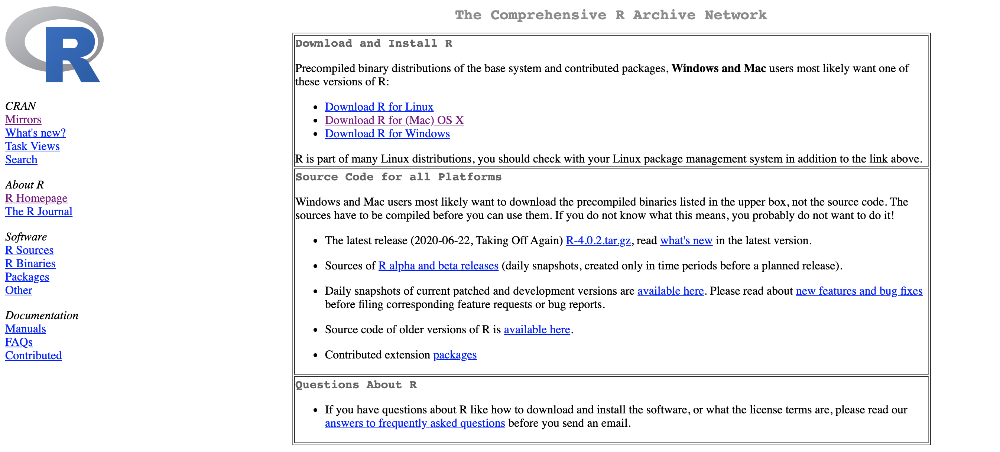
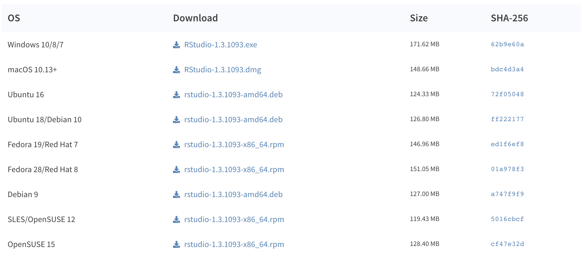
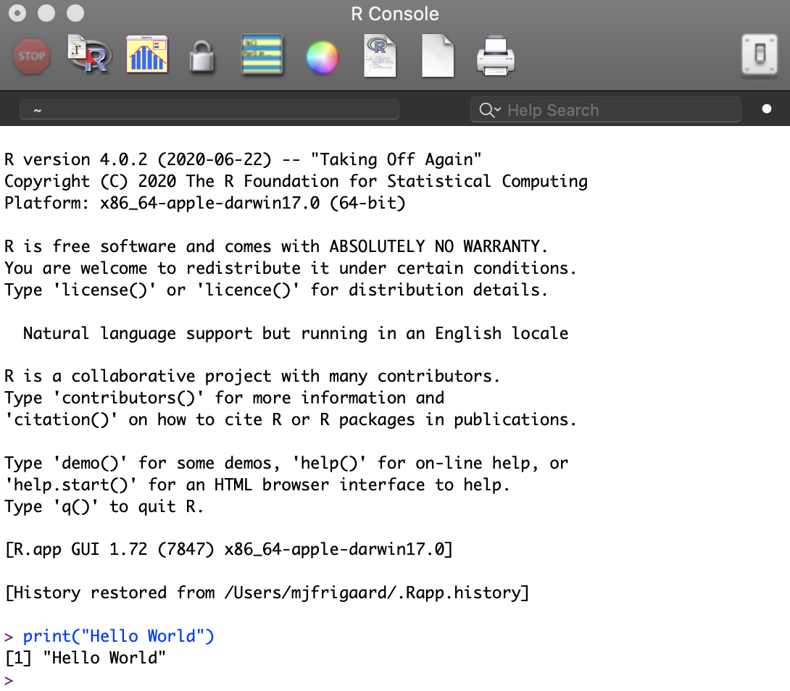
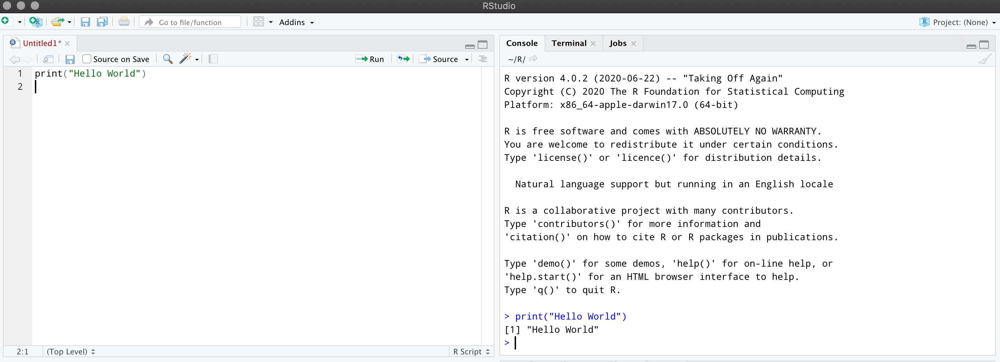

```{r setup, include=FALSE}
library(xaringanthemer)
library(xaringan)
library(pagedown)
library(tidyverse)
```

```{r xaringan-themer, include=FALSE, warning=FALSE}
library(xaringanthemer)
xaringanthemer::style_duo_accent(primary_color = "#035AA6", secondary_color = "#03A696")
# xaringan::inf_mr() # for instant knitting and reviewing
```

class: left, top

# Course Materials 

<br></br>

## Course website:

https://annajiat.github.io/2021-07-06-asu-online/

<br></br>

## Software Carpentry

These materials accompany day 2, "[R for Reproducible Scientific Analysis (Continued)](https://swcarpentry.github.io/r-novice-gapminder/)"

---
class: center, middle

# Why R?

### R is a versatile language for data wrangling, visualization, and modeling


---
background-image: url("https://www.r-project.org/logo/Rlogo.png")
background-size: contain
class: inverse, center, middle

# Getting Started


.pull-left[

<br></br>
<br></br>
<br></br>
<br></br>
<br></br>
<br></br>
<br></br>
<br></br>

Image credit: [R Project](https://www.r-project.org)

]

---
class: left, top

# Installing R

Install R from the Comprehensive R Archive Network (CRAN):

https://cran.r-project.org/


```{r cran, eval=TRUE, echo=FALSE}

```

--

You are recommended to use the [RStudio IDE](https://www.rstudio.com/products/rstudio/) (*but you do not have to*).


---
class: left, top

# Download RStudio

https://rstudio.com/products/rstudio/download/

```{r rstudio, eval=TRUE, echo=FALSE}

```


---
background-image: url("img/r-console.png")
background-size: contain
class: center, bottom

# The R Console

---
background-image: url("img/rstudio-launch.png")
background-size: contain
class: left, middle

# The RStudio IDE


---
class: left, top

# Running R Commands

You can run R commands in the Console by entering them after the `>` operator (see example in R below)

.pull-left[

```{r hello-world}
print("Hello World")
```

]

--

.pull-right[


```{r commands-console, eval=TRUE, echo=FALSE, out.height="120%", out.width="120%", fig.align='center'}

```

]

---
class: left

# Running R Commands

You can also run them in R scripts (see example in RStudio below)

--

```{r script-rstudio, eval=TRUE, echo=FALSE, out.height='110%', out.width='110%', fig.align='center'}

```


---
background-image: url("https://www.r-project.org/logo/Rlogo.png")
background-size: contain
class: inverse, center, top

# `Objects`

---
class: left

# Objects

--

## R is typically referred to as an "*object-oriented, functional programming*" language

--

## Most things in R are either functions or objects (and "*functions do things to objects*")

---
class: left, top

# Types of objects in R 

.pull-left[

- **Vectors**

 - atomic (logical, integer, double, and character)
 
 - S3 (factors, dates, date-times, durations)

- **Matrices**

 - two dimensional objects
 
 ]
 
 .pull-right[

- **Arrays**

 - multidimensional objects

- **Data frames & tibbles**  

 - rectangular objects

- **Lists** 

 - recursive objects
 
 ]
 
---
background-image: url("https://www.r-project.org/logo/Rlogo.png")
background-size: contain
class: inverse, center, top

# `Atomic Vectors`

---
class: left, top

# Atomic Vectors

Vectors are the fundamental data type in R. 

--

Many of R's functions are *vectorised*, which means they're designed for performing operations on vectors.

--

The "atomic" in atomic vectors means, "*of or forming a single irreducible unit or component in a larger system.*"

--

Atomic vectors can be logical, integer, double, or character (strings). 

--

We will build each of these vectors using the previously covered assignment operator (`<-`) and `c()` function (*which stands for 'combine'*).

---
class: left, top

# Store and Explore

--

.pull-left[

A common practice in R is to create an object, perform an operation on that object with a function, and store the results in new object.

We then explore the contents of the new object with another function. 

]

--

.pull-right[

```{r store-explore, echo=FALSE, out.height='120%', out.width='120%', fig.align='center'}
knitr::include_graphics(path = "img/store-explore.png")
```

]

--

***

Many of the functions in R are written with this *store and explore* process in mind.

---
class: left, top

# Atomic vectors: numeric

The two atomic numeric vectors are integer and double. 

--

Integer vectors are created with a number and capital letter `L` (i.e. `1L`, `10L`)

```{r create-vec_integer}
vec_integer <- c(1L, 10L, 100L)
```

--

Double vectors can be entered as decimals, but they can also be created in scientific notation (`2.46e8`), or values determined by the floating point standard (`Inf`, `-Inf` and `NaN`).

```{r create-vec_double}
vec_double <- c(0.1, 1.0, 10.01)
```

---
class: left, top

# Atomic vectors: numeric

We will use the `typeof()` and `is.numeric()` functions to explore the contents of `vec_integer` and `vec_double`.

```{r explore-numeric-vectors}
typeof(vec_integer)
```

--

```{r is.numeric-vec_integer}
is.numeric(vec_integer)
```

--

`typeof()` tells us that this is an `"integer"` vector, and `is.numeric()` tests to see if it is numeric (which is `TRUE`).


---
class: left, top

# Atomic vectors: logical vectors

Logical vectors can be `TRUE` or `FALSE` (or `T` or `F` for short). Below we use `typeof()` and `is.logical()` to explore the contents of `vec_logical`.

--

```{r logical-vectors}
vec_logical <- c(TRUE, FALSE)
typeof(vec_logical)
```

--

```{r is.logical}
is.logical(vec_logical)
```

---
class: left, top

# Atomic vectors: logical vectors


Logical vectors are handy because when we add them together, and the total number tells us how many `TRUE` values there are. 

```{r logical-addition}
TRUE + TRUE + FALSE + TRUE
```

--

Logical vectors can be useful for subsetting (a way of extracting certain elements from a particular object) based on a set of conditions. 

--

*How many elements in `vec_integer` are greater than `5`?*

```{r vec_integer-gt-5}
vec_integer > 5
```


---
class: left, top

# Atomic vectors: character vectors

Character vectors store text data (note the double quotes). We'll *store and explore* again.

--

```{r character-vectors}
vec_character <- c("A", "B", "C")
typeof(vec_character)
```

--

```{r is.character-vec_character}
is.character(vec_character)
```

--

Character vectors typically store text information that we need to include in a calculation, visualization, or model. In these cases, we'll need to convert them into `factor`s. We'll cover those next. 

---
background-image: url("https://www.r-project.org/logo/Rlogo.png")
background-size: contain
class: inverse, center, top

# `S3 Vectors`

---
class: left, top

# S3 Vectors

## S3 Vectors can be factors, dates, date-times, and difftimes.

### Vectors with additional attributes:

#### - `"levels"`

#### - `"tzone"`

#### - `"names"`


---
class: left, top

# S3 Vectors: factors 

Factors are categorical vectors with a given set of responses. Below we create a factor with three levels: `low`, `medium`, and `high`

--

```{r vec_factor}
vec_factor <- factor(x = c("low", "medium", "high"))
class(vec_factor)
```

--

Factors are not character variables, though. They get stored with an integer indicator for each character level. 

```{r typeof-vec_factor}
typeof(vec_factor)
```

---
class: left, top

# S3 Vectors: factor attributes

Factors are integer vectors with two additional attributes: `class` is set to `factor`, and `levels` for each unique response.

--

We can check this with `unique()` and `attributes()` functions. 

```{r unique-vec_factor, highlight.output = 2}
unique(vec_factor)
```

--

```{r attributes-vec_factor, highlight.output = 1}
attributes(vec_factor)
```

---
class: left, top

# S3 Vectors: factor attributes 

Levels are assigned alphabetically, but we can manually assign the order of factor levels with the `levels` argument in `factor()`.

--

```{r levels}
vec_factor <- factor(x = c("medium", "high", "low"), 
                     levels = c("low", "medium", "high"))
```

--

We can check the levels with `levels()` or `unclass()`

```{r levels-vec_factor}
levels(vec_factor)
```

--

```{r unclass-vec_factor, highlight.output = c(1, 3)}
unclass(vec_factor)
```


---
class: left, top

# S3 Vectors: date

Dates are stored as `double` vectors with a `class` attribute set to `Date`.  

--

R has a function for getting today's date, `Sys.Date()`. We'll create a `vec_date` using `Sys.Date()` and adding `1` and `2` to this value. 

```{r vec_date}
vec_date <- c(Sys.Date(), Sys.Date() + 1, Sys.Date() + 2)
vec_date
```

--

We can see adding units to the `Sys.Date()` added days to today's date. 

--

The `attributes()` function tells us this vector has it's own class. 

```{r attributes-vec_date}
attributes(vec_date)
```

---
class: left, top

# S3 Vectors: date calculations

Dates are stored as a number because they represent the amount of days since January 1, 1970, which is referred to as the [UNIX Epoch](https://en.wikipedia.org/wiki/Unix_time).

--

`unclass()` tells us what the actual number is.

```{r unclass-vec_date}
unclass(vec_date)
```


---
class: left, top

# S3 Vectors: date-time

Date-times contain a bit more information than dates. The function to create a datetime vector is `as.POSIXct()`. 

We'll convert `vec_date` to a date-time and store it in `vec_datetime_ct`. View the results below.

--

```{r view-vec_date}
vec_date
```

--

```{r vec_datetime_ct}
vec_datetime_ct <- as.POSIXct(x = vec_date)
vec_datetime_ct
```

We can see `vec_datetime_ct` stores some additional information. 

---
class: left, top

# S3 Vectors: date-time attributes

`vec_datetime_ct` is a `double` vector with an additional attribute of `class` set to `"POSIXct" "POSIXt"`.

```{r typeof-vec_datetime_ct}
typeof(vec_datetime_ct)
```

--

```{r attributes-vec_datetime_ct}
attributes(vec_datetime_ct)
```

---
class: left, top

# S3 Vectors: date-time help

.pull-left[

Read more about date-times by entering the `as.POSIXct` function into the console preceded by a question mark. 

```{r help-as.POSIXct-console, eval=FALSE}
?as.POSIXct
```

]

--

.pull-right[

```{r help-date-time, echo=FALSE, out.height="120%", out.width="120%", fig.align='center'}
knitr::include_graphics(path = "img/help-date-time.png")
```

]

---
class: left, top

# S3 Vectors: difftime

Difftimes are durations, so we need to supply two dates, which we will create with `time_01` and `time_02`.

```{r vec_difftime}
time_01 <- Sys.Date()
time_02 <- Sys.Date() + 10
vec_difftime <- difftime(time_01, time_02, units = "days")
vec_difftime
```

--

Difftimes are stored as a `double` vector. 

```{r typeof-vec_difftime}
typeof(vec_difftime)
```

---
class: left, top

# S3 Vectors: difftime attributes

Difftimes are their own `class` and have a `units` attribute set to whatever we've specified in the `units` argument.


```{r attributes-vec_difftime, highlight.output=4}
attributes(vec_difftime)
```

--

We can see the actual number stored in the vector with `unclass()`

```{r unclass-vec_difftime, highlight.output=2}
unclass(vec_difftime)
```

---
background-image: url("https://www.r-project.org/logo/Rlogo.png")
background-size: contain
class: inverse, center, top

# `Matrices`

---
class: left, top

# Matrices 

A matrix is several vectors stored together into two a two-dimensional object. 

```{r mat_data}
mat_data <- matrix(data = c(vec_double, vec_integer), 
                   nrow = 3, ncol = 2, byrow = FALSE)
mat_data
```

This is a three-column, two-row matrix. 

We can check the dimensions of `mat_data` with `dim()`.

```{r dim-mat_data}
dim(mat_data)
```


---
class: left, top

# Matrix positions

The output in the console tells us where each element is located in `mat_data`. 

For example, if I want to get the `10` that's stored in `vec_integer`, I can use look at the output and use the indexes. 

--

.pull-left[

```{r mat_data-subset, highlight.output=c(1,3)}
mat_data
```

]

--

.pull-right[


```{r subset-10}
mat_data[2, 2]
```
]

--

By placing the index (`[2, 2]`) next to the object, I am telling R, "*only return the value in this position*".

---
background-image: url("https://www.r-project.org/logo/Rlogo.png")
background-size: contain
class: inverse, center, top

# `Arrays`

---
class: left, top

# Arrays

Arrays are like matrices, but they can have more dimensions. Below we create a 3x3x3 array using the `seq()` function. 

```{r array_dat}
array_dat <- array(
  data = c(
    seq(0.3, 2.7, by = 0.3),
    seq(0.5, 4.5, by = 0.5),
    seq(3, 27, by = 3)
  ),
  dim = c(3, 3, 3)
)
```


---
class: left, top

### Array layers

.pull-left[

`array_dat` contains numbers in three columns and three rows, stacked in three *layers*.

```{r array-png, out.height='85%', out.width='85%', fig.align='center', echo=FALSE}
knitr::include_graphics(path = "img/array.png")
```

]

--

.pull-right[

```{r print-array_dat}
array_dat
```

]

---
class: left, top

# Arrays vs. matrices

### Matrices are arrays, but arrays are not matrices.

.pull-left[ 

```{r}
is.matrix(array_dat)
is.array(mat_data)
```

]

--

.pull-right[ 

```{r class-array-matrix}
class(array_dat)
class(mat_data)
```

]

---
background-image: url("https://www.r-project.org/logo/Rlogo.png")
background-size: contain
class: inverse, center, top

# `Data Frames`


---
class: left, top

# Data Frames

Data frames are rectangular data with rows and columns (or observations and variables).

```{r DataFrame, highlight.output = 1}
DataFrame <- data.frame(character = c("A", "B", "C"), 
                       integer = c(0.1, 1.0, 10.01), 
                       logical = c(TRUE, FALSE, TRUE), 
                        stringsAsFactors = FALSE)
DataFrame
```

NOTE: `stringsAsFactors = FALSE` is not required as of R version 4.0.0.

---
class: left

# Data Frames

Check the structure of the `data.frame` with `str()`

```{r str-DataFrame, highlight.output = 1}
str(DataFrame)
```

`str()` gives us a transposed view of the `DataFrame` object, and tells us the dimensions of the object.


---
class: left, top

# Data Frames 

If you're importing spreadsheets, most of the work you'll do in R will be with rectangular data objects (i.e. `data.frame`s).

--

.pull-left[

```{r data-frame-tibble, echo=FALSE, out.width='80%', out.height='80%', fig.align='center'}
knitr::include_graphics(path = "img/data-frame-import.png")
```

]

--

.pull-right[

*These are the common rectangular data storage object for tabular data in R*

]

---
class: left

# Data Frames 

### What type of object is a `data.frame`?

.pull-left[

If we check `DataFrame` with `dput()`...

```{r compare-DataFrame}
DataFrame
```

]

.pull-right[

```{r dput-DataFrame, eval=FALSE}
dput(DataFrame)
```

```
## structure(list(
##  character = c("A", "B", "C"), 
##  integer = c(0.1, 1, 10.01), 
##  logical = c(TRUE, FALSE, TRUE)), 
##  class = "data.frame", 
##  row.names = c(NA, -3L))
```

...we see they are `lists`

]

---
class: left

# Data Frames  

`data.frame`s are lists with their own class

```{r class-DataFrame}
typeof(DataFrame)
class(DataFrame)
```

...so we can think of `data.frame`s as a special kind of *rectangular* lists, made with different types of vectors, with each vector being of equal length.


---
background-image: url("https://www.r-project.org/logo/Rlogo.png")
background-size: contain
class: inverse, center, top

# `Lists`


---
class: left

# Lists 

Lists are special objects because they can contain all other objects (including other lists).

```{r dat_list}
dat_list <- list("integer" = vec_integer, 
                 "array" = array_dat,
                 "matrix" = mat_data,
                 "data.frame" = DataFrame)
```

Lists have a `names` attribute, which we've defined above in double quotes.

```{r attributes-list, highlight.output=1}
attributes(dat_list)
```

---
class: left

# List structure

If we check the `str()` of `dat_list`, we see the structure of list, and the structure of the elements in the list.

```{r str-dat_list, highlight.output=c(2,3,4,5)}
str(dat_list)
```


---
background-image: url("https://www.r-project.org/logo/Rlogo.png")
background-size: contain
class: inverse, center, top

# `Subsetting`

---
class: left

# Subsetting Vectors

### We can subset vectors using brackets `[]`

```{r subsetting-vectors-brackets}
# single item
vec_character[1]
# range of items
vec_character[1:3]
# vector of items
vec_character[c(1, 3)]
```


---
class: left

# Subsetting Matrices

### Matrices are two-dimensional, so we need to use a comma to separate each position in the brackets `[ , ]`

.pull-left[

```{r}
# review 
mat_data
```

]

.pull-right[

```{r matrix-subset, highlight.output=1}
mat_data[ , 2]
mat_data[3,  ]
mat_data[1, 2]
```

]

---
class: left

# Subsetting Arrays

### Arrays contain a collection of equal-dimension matrices, so we need to use a comma to separate each position in the bracket `[ , ]`

.pull-left[

```{r}
# review 
dim(array_dat)
```
```{r, highlight.output=1}
array_dat[3, , 2]
```

]

.pull-right[

```{r array-subset, highlight.output=1}
array_dat[1, c(3, 2), 2]
array_dat[1, , ]
```

]


---
class: left

# Subsetting Arrays

If we only supply a single row `array_dat[1, , ]`, we will see R returns the rows as a column in a single matrix. They are also arranged by columns, not rows.


.pull-left[

Here is the original arrangement of the first rows:

```{r array-subset.png, out.height='40%', out.width='40%', fig.align='center', echo=FALSE}
knitr::include_graphics(path = "img/array-subset.png")
```


]

.pull-right[

And here is the returned matrix, presented as columns:

```{r array-return-cols.png, out.height='65%', out.width='65%', fig.align='center', echo=FALSE}
knitr::include_graphics(path = "img/array-return-cols.png")
```

]


---
class: left

# Subsetting Data frames

### There are multiple ways to subset `data.frame`'s

.pull-left[
```{r}
# subset named vectors
DataFrame$character
# row 1, column 2
DataFrame[1, 2]
# using c() & []
DataFrame[c(1, 3), "logical"]
```
]

.pull-right[
```{r , warning=FALSE}
# using $ and []
DataFrame$character[2]
# using $ & ==
DataFrame$integer == 1
```
]

---
class: left

## Subsetting Data frames (advanced)

### We can combine all three (and more!)

Notice these return `data.frame`s

```{r}
# using [], $ and >=
DataFrame[DataFrame$integer >= 1, ]
```

```{r}
# using [], $, %in% and c()
DataFrame[DataFrame$character %in% c("A", "C"), ]
```


---
class: left

## Subsetting Data frames (warning!)

### The class of the return object depends on the brackets

.pull-left[

using `[]` vs. `[[]]`

```{r}
DataFrame["character"]
DataFrame[["character"]]
```


]


.pull-right[

Note the `class()`

```{r}
# column as data frame
class(DataFrame["character"])
# column as character vector
class(DataFrame[["character"]])
```
]

---
class: left

# Subsetting Lists (single brackets)

.pull-left[

Singe bracket `data.frame`

```{r}
# numeric position returns 
# a data.frame
DataFrame[3]
# name returns a vector
DataFrame[ , "logical"]
```

]

--

.pull-right[

Single bracket `list`

```{r}
# numeric position
dat_list[3]
# name
dat_list["matrix"]
```

]

---
class: left

# Subsetting Lists (double brackets)

.pull-left[

Double bracket (`data.frame`) 

```{r}
# numeric position
DataFrame[[3]]
# name
DataFrame[["logical"]]
```

]

--

.pull-right[

Double bracket (`list`) 

```{r}
# numeric position
dat_list[[3]]
# name 
dat_list[["matrix"]]
```

]

---
class: left

# Subsetting Lists

### We can subset any object in a list using the methods above

```{r}
# single $
dat_list$integer
```

--

```{r}
# $ & []
dat_list$array[3, , 2]
```

--


```{r}
# $, [] and >=
dat_list$data.frame[dat_list$data.frame$integer < 1, ]
```

---
background-image: url("https://www.r-project.org/logo/Rlogo.png")
background-size: contain
class: inverse, center, top

# `Recap`

---
class: left, top

# Recap

--

**The most common R object is a vector**

 - Atomic vectors: *logical, integer, double, or character (strings)*  
 - S3 Vectors: *factors, dates, date-times, and difftimes*  
 
--

**More complicated data structures: matrices and arrays**  

  - Matrix: *two-dimensional object*   
  - Array: *multidimensional object*  

--

**Rectangular data structures:**

  - *`data.frame`s & `tibble`s are special kinds of rectangular lists, which can hold different types of vectors, with each vector being of equal length* 
--


**Catch-all data structures:**

  - *lists can contain all other objects (including other lists)*

---
class: left, top

# More resources

Learn more about R objects in the help files or the following online texts: 

1. [R for Data Science](https://r4ds.had.co.nz/) 

2. [Advanced R](https://adv-r.hadley.nz/)  

3. [Hands on Programming with R](https://rstudio-education.github.io/hopr/r-objects.html)

4. [R Language Definition](https://cran.r-project.org/doc/manuals/r-release/R-lang.html#Objects)

---
class: center, top

# THANK YOU!

## Feedback

@mjfrigaard on Twitter and Github

mjfrigaard@pm.me 
